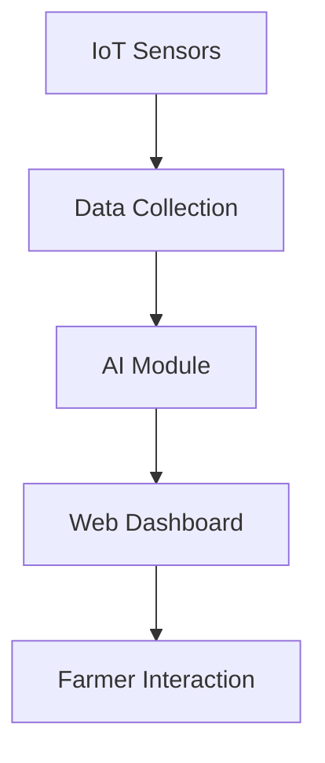

# 🌾 FarmFlow – Personalized Rainwater Harvesting System

[](https://epics-farm-flow.vercel.app/)
[](https://github.com/SUHAANII/EPICS_FarmFlow)
[](#)
[](#)

---

## 📌 One Liner
**FarmFlow** is an intelligent, AI + IoT-powered platform designed to personalize rainwater harvesting solutions for farmers—empowering them to adapt to changing climate and reduce water scarcity risks.

---

## 📚 Table of Contents
- [About the Project](#about-the-project)
- [Problem Statement](#problem-statement)
- [Our Solution](#our-solution)
- [Key Features](#key-features)
- [How It Works](#how-it-works)
- [Tech Stack](#tech-stack)
- [Screenshots](#screenshots)
- [Impact](#impact)
- [Future Scope](#future-scope)
- [Getting Started](#getting-started)
- [Contributors](#contributors)
- [License](#license)

---

## 📖 About the Project
FarmFlow is developed under the **EPICS (Engineering Projects in Community Service)** initiative. It leverages Artificial Intelligence, IoT sensors, and Web technologies to create a tailored rainwater harvesting experience for rural farmers.

Our mission is to empower agricultural communities with **data-driven water conservation practices** and **climate-resilient farming tools**.

---

## ❗ Problem Statement
India’s farmers face unpredictable monsoons, leading to:
- Water scarcity or overwatering
- Reduced crop yields
- Lack of accessible water management systems

Traditional rainwater harvesting is **generic**, not adaptive to local field conditions.

---

## 💡 Our Solution – FarmFlow
FarmFlow delivers **personalized harvesting strategies** by:
- Using **real-time sensor data** (moisture, rainfall, etc.)
- Applying **AI models** to generate recommendations
- Providing an **interactive dashboard** to monitor water levels and receive alerts

It enables **intelligent decision-making** for better water management.

---

## 🌟 Key Features
- 📊 Real-Time Soil & Rainfall Monitoring  
- 🤖 AI-Based Harvesting Recommendations  
- 📍 Location-Aware Water Insights  
- 🧠 Smart Dashboard for Farmers  
- 📈 Visual Analytics & Predictions  
- 🌱 Climate Adaptation Alerts

---

## ⚙️ How It Works
1. **Sensors** capture environmental data (rain, soil moisture).
2. **AI models** process this data to assess water needs.
3. **The dashboard** presents insights and suggestions.
4. **Farmers act** on real-time, tailored harvesting strategies.



---

## 🛠️ Tech Stack
| Layer            | Tools Used                             |
|------------------|-----------------------------------------|
| 🌐 Frontend      | HTML, CSS, JavaScript                   |
| ⚙ Backend        | Node.js / Express                       |
| 📊 AI Modeling   | Python, Scikit-learn (optional setup)   |
| 🌦 IoT Layer     | Soil/Rain sensors + Microcontroller     |
| ☁️ Hosting       | [Vercel](https://vercel.com/)           |

---

## 🖼 Screenshots

### 📍 Home Page
(https://epics-farm-flow.vercel.app/assets/home.png)

### 📈 Smart Dashboard
(https://epics-farm-flow.vercel.app/assets/dashboard.png)


## 🌍 Impact
✅ Helps farmers manage water sustainably  
✅ Reduces overuse of groundwater  
✅ Supports climate-resilient agriculture  
✅ Bridges tech gap in rural areas  
✅ Data-driven solutions improve crop productivity

---

## 🚀 Future Scope
- Multilingual dashboard for better accessibility  
- Integration with government schemes and subsidies  
- Mobile app version for low-connectivity zones  
- Satellite-based rainfall data enhancement  

---

## 🧑‍💻 Getting Started

To run this project locally:

```bash
git clone https://github.com/SUHAANII/EPICS_FarmFlow.git
cd EPICS_FarmFlow
npm install
npm start
```

---

## 👥 Contributors
Made with 💚 by **Suhani Sinha** and **Team EPICS**

---

## 📝 License
This project is licensed under the **MIT License** — feel free to use and improve it for social good 🌱

---

> 🔗 **Live Website:** [https://epics-farm-flow.vercel.app/](https://epics-farm-flow.vercel.app/)  
> 💻 **Source Code:** [https://github.com/SUHAANII/EPICS_FarmFlow](https://github.com/SUHAANII/EPICS_FarmFlow)  
> 🌱 Empowering climate-smart agriculture, one drop at a time.
